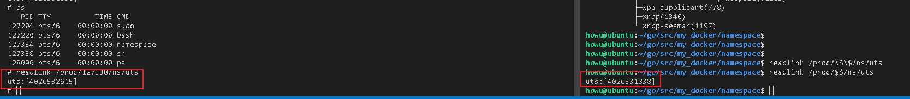
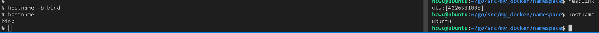
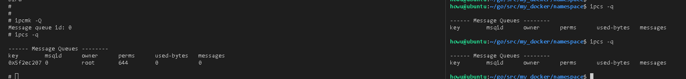
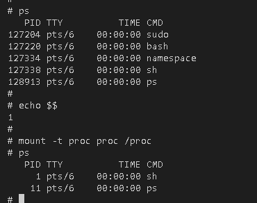
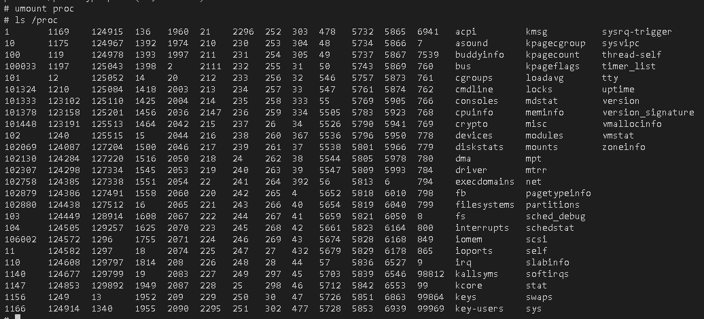
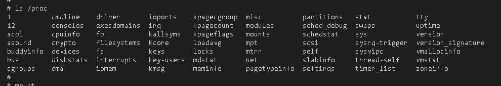
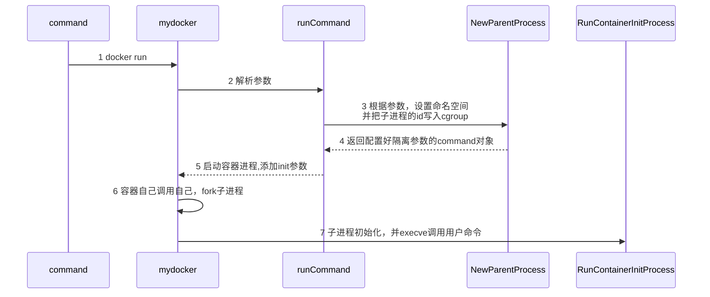

# namespace

## UTS

UTS Namespace主要用来隔离nodename和domainname两个系统标识。在UTS namespace里，每个namespace允许有自己的hostname。

**验证**

两个进程处于不同的UTS命名空间



更改hostname，不会影响外部




## IPC

IPC是用来隔离Linux IPC通讯的一些资源，比如消息队列

**验证**




## PID MOUNT

ps和top命令会使用/proc内容，所以ps显示还是host的进程组，重新挂载/proc，就会显示当前的进程关系。




mount命名空间：

https://www.jianshu.com/p/1caa3d7bc2cd

https://www.51cto.com/article/672032.html


**mount前后对比**

mount前：



mount后：




# cgroup

## cgroup操作

```shell
howu@ubuntu ~/s/docker_stu> mkdir cgroup-test
howu@ubuntu ~/s/docker_stu>
howu@ubuntu ~/s/docker_stu>
howu@ubuntu ~/s/docker_stu> sudo mount -t cgroup -o none,name=cgroup-test cgroup-test ./cgroup-test/
[sudo] password for howu:
howu@ubuntu ~/s/docker_stu> ls
cgroup-test/
howu@ubuntu ~/s/docker_stu> ls ./cgroup-test/
cgroup.clone_children  cgroup.procs  cgroup.sane_behavior  notify_on_release  release_agent  tasks
howu@ubuntu ~/s/docker_stu>
howu@ubuntu ~/s/docker_stu>
howu@ubuntu ~/s/docker_stu> cd cgroup-test/
howu@ubuntu ~/s/d/cgroup-test>
howu@ubuntu ~/s/d/cgroup-test> sudo mkdir cgroup-1
howu@ubuntu ~/s/d/cgroup-test> sudo mkdir cgroup-2
howu@ubuntu ~/s/d/cgroup-test> tree
.
├── cgroup-1
│   ├── cgroup.clone_children
│   ├── cgroup.procs
│   ├── notify_on_release
│   └── tasks
├── cgroup-2
│   ├── cgroup.clone_children
│   ├── cgroup.procs
│   ├── notify_on_release
│   └── tasks
├── cgroup.clone_children
├── cgroup.procs
├── cgroup.sane_behavior
├── notify_on_release
├── release_agent
└── tasks

2 directories, 14 files

```


# docker run梳理




# 其它

## /proc/[pid]/mountinfo--code3.2

https://manpages.courier-mta.org/htmlman5/proc.5.html

```
36 35 98:0 /mnt1 /mnt2 rw,noatime master:1 − ext3 /dev/root rw,errors=continue
(1)(2)(3)   (4)   (5)      (6)      (7)   (8) (9)   (10)         (11)
```

(1)

mount ID: a unique ID for the mount (may be reused after [umount(2)](https://manpages.courier-mta.org/htmlman2/umount.2.html)).

(2)

parent ID: the ID of the parent mount (or of self for the root of this mount namespace's mount tree).

(3)

major:minor: the value of `st_dev` for files on this filesystem (see [stat(2)](https://manpages.courier-mta.org/htmlman2/stat.2.html)).

(4)

root: the pathname of the directory in the filesystem which forms the root of this mount.

(5)

mount point: the pathname of the mount point relative to the process's root directory.

(6)

mount options: per-mount options (see [mount(2)](https://manpages.courier-mta.org/htmlman2/mount.2.html)).

(7)

optional fields: zero or more fields of the form "tag[:value]"; see below.

(8)

separator: the end of the optional fields is marked by a single hyphen.

(9)

filesystem type: the filesystem type in the form "type[.subtype]".

(10)

mount source: filesystem-specific information or "none".

(11)

super options: per-superblock options (see [mount(2)](https://manpages.courier-mta.org/htmlman2/mount.2.html)).


## docker save和export区别

https://blog.csdn.net/liukuan73/article/details/78089138


## pivot_root和chroot的区别


## umount卸载不掉

https://serverfault.com/questions/365149/how-do-i-forcibly-unmount-when-im-getting-stale-nfs-file-handles

**问题现象**

```shell
none on /home/howu/go/src/my_docker/rootfs/mnt type aufs (rw,relatime,si=ea62a448e5405c19)
```

**解决方式**

fusermount -u  路径

https://juejin.cn/post/6844903741158588429     （实际解决方式）

http://cn.voidcc.com/question/p-zfkzapey-vb.html


